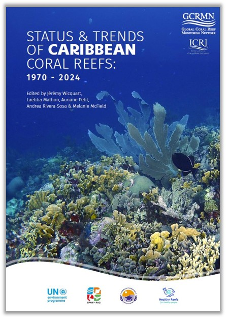

<!-- README.md is generated from README.Rmd. Please edit that file -->

```{r, include = FALSE}
knitr::opts_chunk$set(
  collapse = TRUE,
  comment = "",
  out.width = "100%"
)
options(tibble.print_min = 5, tibble.print_max = 5)
```

# **Status and Trends of Caribbean Coral Reefs: 1970-2024**


## 1. Introduction [](https://gcrmn.net/pacific-report-2025-v1/)

Lorem ipsum dolor sit amet, consectetur adipiscing elit. Sed non risus. Suspendisse lectus tortor, dignissim sit amet, adipiscing nec, ultricies sed, dolor. Cras elementum ultrices diam. Maecenas ligula massa, varius a, semper congue, euismod non, mi. Proin porttitor, orci nec nonummy molestie, enim est eleifend mi, non fermentum diam nisl sit amet erat. Duis semper. Duis arcu massa, scelerisque vitae, consequat in, pretium a, enim. Pellentesque congue. Ut in risus volutpat libero pharetra tempor. Cras vestibulum bibendum augue. Praesent egestas leo in pede. Praesent blandit odio eu enim. Pellentesque sed dui ut augue blandit sodales. Vestibulum ante ipsum primis in faucibus orci luctus et ultrices posuere cubilia Curae; Aliquam nibh. Mauris ac mauris sed pede pellentesque fermentum. Maecenas adipiscing ante non diam sodales hendrerit.

Ut velit mauris, egestas sed, gravida nec, ornare ut, mi. Aenean ut orci vel massa suscipit pulvinar. Nulla sollicitudin. Fusce varius, ligula non tempus aliquam, nunc turpis ullamcorper nibh, in tempus sapien eros vitae ligula. Pellentesque rhoncus nunc et augue. Integer id felis. Curabitur aliquet pellentesque diam. Integer quis metus vitae elit lobortis egestas. Lorem ipsum dolor sit amet, consectetuer adipiscing elit. Morbi vel erat non mauris convallis vehicula. Nulla et sapien. Integer tortor tellus, aliquam faucibus, convallis id, congue eu, quam. Mauris ullamcorper felis vitae erat. Proin feugiat, augue non elementum posuere, metus purus iaculis lectus, et tristique ligula justo vitae magna.

Aliquam convallis sollicitudin purus. Praesent aliquam, enim at fermentum mollis, ligula massa adipiscing nisl, ac euismod nibh nisl eu lectus. Fusce vulputate sem at sapien. Vivamus leo. Aliquam euismod libero eu enim. Nulla nec felis sed leo placerat imperdiet. Aenean suscipit nulla in justo. Suspendisse cursus rutrum augue. Nulla tincidunt tincidunt mi. Curabitur iaculis, lorem vel rhoncus faucibus, felis magna fermentum augue, et ultricies lacus lorem varius purus. Curabitur eu amet.

## 2. Code

### Functions

* `combine_model_data.R` Combine benthic cover model results.
* `combine_plot_trends.R` Combine temporal trend plots produced by the function _plot_trends.R_.
* `create_chapter_doc.qmd` Countries and territories chapter template.
* `data_descriptors.R` Get number of sites, surveys, datasets, first and last year of monitoring.
* `download_predictors.R` Download predictors extracted through GEE and stored on Google Drive.
* `extract_coeff.R` Extract linear models _a_ and _b_ coefficients.
* `extract_mankendall.R` Calculate temporal trends using Man Kendall test.
* `graphical_par.R` Graphical parameters, including colors and fonts.
* `plot_pred_obs.R` Plot predicted _vs_ observed values (model evaluation).
* `plot_region.R` Regional background map.
* `plot_residuals.R` Plot residuals (model evaluation).
* `plot_trends.R` Plot temporal trends.
* `plot_vimp.R` Plot Variable Importance Plot (VIMP).
* `prepare_benthic_data.R` Prepare benthic cover data.
* `plot_pdp.R` Plot Partial Dependence Plot (PDP).
* `plot_prediction_map.R` Plot the map of the Caribbean with predicted values.
* `render_qmd.R` Render script _create_chapter_doc.qmd_.
* `theme_graph.R` Main ggplot theme for plots.
* `theme_map.R` Main ggplot theme for maps.
* `theme_map_area.R` ggplot theme for countries and territories maps.

### Cleaning and selection (`a_`)

* `a01_select_topo-bathy.js` Extract topography and bathymetry using [Google Earth Engine](https://earthengine.google.com/) (GEE).
* `a02_clean_shp.R` Clean shapefiles from different sources.
* `a03_select_benthic-data.R` Extract benthic cover data from [gcrmndb_benthos](https://github.com/GCRMN/gcrmndb_benthos).
* `a04_benthic-data_sources.R` Extract lists of datasetID and contributors details.
* `a05_reef-buffer.js` Create coral reef buffer polygons at 20, 50, and 100 km using [GEE](https://earthengine.google.com/).
* `a06_reef-buffer-area.R` Join reef buffer with areas' boundaries.
* `a07_clean_cyclones.R` Clean cyclones data.
* `a08_download_crw-year.R` Extract netCDF file aggregated per year from Coral Reef Watch (CRW).

### Indicators' extraction (`b_`)

* `b01_extract_indicator_population.js` Extract population indicators using [GEE](https://earthengine.google.com/).
* `b02_extract_indicator_sst.R` Extract SST indicators.
* `b03_extract_indicator_cyclones.R` Extract cyclones indicators.

### Models (benthic cover) (`c_`)

* `c01_explo_benthic-data.qmd` Exploratory analyses of benthic cover data.
* `c02_select_pred-sites.js` A
* `c03_extract_predictor_gee.js` A
* `c04_extract_predictor_gravity.R` A
* `c05_extract_predictor_enso.R` A
* `c06_extract_predictor_cyclones.R` A
* `c07_extract_predictor_crw.R` A
* `c08_model_data-preparation.R` Combine predictors and prepare cover benthic data.
* `c09_xgboost-model.R` Run XGBoost models.

### Figures and tables (`d_`)

* `d01_materials-and-methods.R` Produce figures for the Materials and Methods.
* `d02_region_map.R` Produce map of the region.
* `d03_areas_map.R` Produce contextual maps for areas.
* `d04_region_sst.R` Produce figures for SST for the region.
* `d05_areas_sst.R` Produce figures for SST for areas.
* `d06_region_cyclones.R` Produce figures for cyclones for the region.
* `d07_areas_cyclones.R` Produce figures for cyclones for areas.
* `d08_region_spatio-temporal.R` Produce figures for spatio-temporal distribution of monitoring for the region.
* `d09_areas_spatio-temporal.R` Produce figures for spatio-temporal distribution of monitoring for areas.
* `d10_benthic-cover_trends.R` Produce figures for benthic cover temporal trends.
* `d11_other-indicators.R` Produce figures, tables, and numbers for other indicators.
* `d12_fish-biomass.R` Produce figure for the fish biomass box.
* `d13_case-study.R` Produce figures for the case studies.

### Writing and sharing (`e_`)

* `e01_create-chapters.R` Generate .docx chapters for areas.
* `e02_authors-contribution.R` Export author's contributions .xlsx file.
* `e03_push-google-drive.R` Export figures to the Google Drive folder.

## 3. Reproducibility parameters

```{r echo=FALSE, message=FALSE}

# 1. Print session info ----

devtools::session_info(c("sf", "terra", "tidyverse", "tidymodels"))

```
